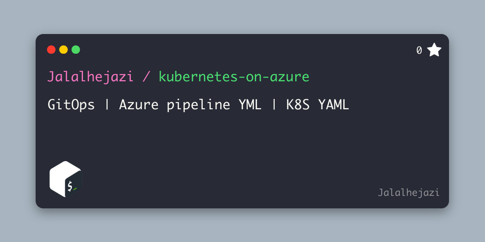

# GitOps Proof-Of-Concept




- Multi-Stage YML Azure-pipeline

- Yet Another Markup Language ==> YML and YAML

```
In this repo *.YAML is used for Kubernetes and *.YML is used for Azure-pipeline 
```

<br>
<br>

- **Diff option** - you can compare the definition which are failing with the last known good configuration.

- **History** - source control allows you to see every change which was done to your pipeline since the initial creation.

- **Rollback** - if you found that your last commit causing any problem during deployment, simple roll it back to last good configuration.

- **Reusability option** - how often you wanted to reuse pipeline which is already defined? - now you can simply do that by copy/paste option.

- **Team Sharing** - if there are multiple people working on same pipeline it can cause problem using GUI, using YAML team members can work on separate branch and adjust definition according to their needs.

- **GitOps** - verything in Git (minus secrets)

## Prerequesite

- At least one AKS cluster should be created

## step: 01

- Go to Pipeline->Environment->Create Environment Type the name of the environment, provide description and choose Kubernetes as a resource and click Next.
   - Create Environment for "development"
   - Create Environment for "test"
   - Create Environment for "production"
   - Create Environment for "etc"
- Find [service connection](https://dev.azure.com/superusers-kursus/kubernetes-on-azure/_settings/adminservices) from project settings and rename 
- [kubernetes-best-practices-organizing-with-namespaces](https://cloud.google.com/blog/products/gcp/kubernetes-best-practices-organizing-with-namespaces)

## step: 02

- You should also configure variable group [under pipelines --> Library ](https://dev.azure.com/superusers-kursus/kubernetes-on-azure/_library?itemType=VariableGroups)
- Before running Azure-pipeline-yaml for first time, assign variable group "kubernetes-on-azure" to pipeline.

```yaml
## Name the variable group: kubernetes-on-azure
DEV_ENVIRONMENT_NAME=development
DEV_CLUSTER_SERVICE_CONNECTION_NAME=development
```


## step: 03
- Run pipeline 
- Change scaling
- etc


<hr>

# Plan B (manual integration), on any reason the CI Pipeline is not working:  

- Connect to your cluster using command line or CloudShell to interact directly with cluster using kubectl, 
the command line tool for Kubernetes. 
Kubectl is available within the Azure Cloud Shell by default and can also be installed locally.

- Connect to https://shell.azure.com/bash/

```bash
cd $home

# clone your own repo
git clone <repo>

## apply any change 
kubectl apply -f 200_angular_kursus_app.yaml

## Destroy everything
kubectl delete -f 200_angular_kursus_app.yaml

```
